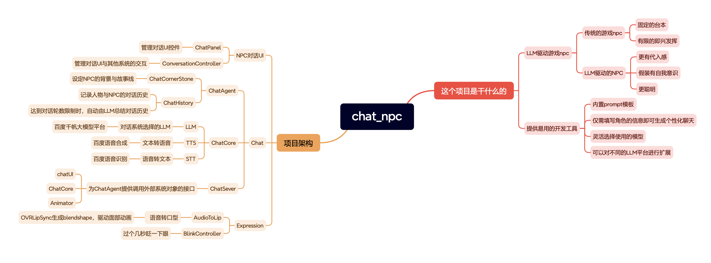

# Chat NPC

### Overview
An intelligent NPC conversation system powered by Large Language Models (LLM) for Unity. This project enables realistic, AI-driven conversations with NPCs, featuring voice input/output, lip-sync animations, and support for both desktop and WebGL platforms.



### ✨ Key Features
- 🤖 **LLM Integration**: Powered by Baidu AI APIs for natural language conversations
- 🎤 **Voice Input**: Real-time speech-to-text (STT) conversion
- 🔊 **Voice Output**: Text-to-speech (TTS) with natural voice synthesis
- 👄 **Lip Sync**: Automatic lip synchronization using OVRLipSync
- 🎭 **Facial Expressions**: Dynamic blinking and viseme-based animations
- 🌐 **WebGL Support**: Deployable to web browsers with microphone support
- 🎮 **Third-Person Controller**: Integrated character controller with conversation triggers
- 💬 **Chat UI**: Intuitive chat interface with text and voice input options

### 📋 System Requirements
- **Unity Version**: 2020.3.44f1 or higher (tested on Unity 6000.0.23f1)
- **Operating System**: Windows, macOS, or Linux
- **For WebGL**: Modern web browser with microphone access support
- **API Keys**: Baidu AI API access (for LLM, TTS, STT services)

### 🚀 Installation

1. **Clone the Repository**
   ```bash
   git clone https://github.com/annajcy/chat_npc.git
   cd chat_npc
   ```

2. **Open in Unity**
   - Launch Unity Hub
   - Click "Add" and select the cloned project folder
   - Open with Unity 2020.3.44f1 or higher

3. **Install Dependencies**
   - The project uses Unity Package Manager
   - Required packages will be automatically installed:
     - Unity Input System
     - TextMesh Pro
     - Cinemachine
     - Animation Rigging

### ⚙️ Configuration

#### 1. Baidu AI API Setup
To use the conversation system, you need to configure Baidu AI API credentials:

1. **Get API Access**
   - Visit [Baidu AI Cloud](https://cloud.baidu.com/)
   - Register and create an application
   - Obtain your `Access Token` for:
     - ERNIE Bot (LLM)
     - Text-to-Speech (TTS)
     - Speech-to-Text (STT)

2. **Configure in Unity**
   - Open the main scene: `Assets/Scenes/chat_code_scene.unity`
   - Find the `ChatCore` GameObject
   - In the Inspector, set:
     - **LLM**: Configure URL and Access Token
     - **TTS**: Configure URL and Access Token
     - **STT**: Configure URL and Access Token

#### 2. Model Selection
The project supports multiple Baidu LLM models:
- Qianfan-Chinese-Llama-2-7B
- ERNIE-Bot
- ERNIE-Bot-turbo
- Other Baidu AI models

Select your preferred model in the `ChatBaidu` component.

### 🎯 Usage

#### Desktop Mode
1. Open the scene `Assets/Scenes/chat_code_scene.unity`
2. Press Play in Unity Editor
3. Use WASD to move the character
4. Approach an NPC and press **C** to start conversation
5. Choose input method:
   - **Text Input**: Type your message and press Enter
   - **Voice Input**: Click the microphone button and speak
6. Press **ESC** to exit conversation mode

#### WebGL Deployment
1. **Build Settings**
   - Go to File → Build Settings
   - Select WebGL platform
   - Configure Player Settings:
     - Color Space: `Gamma`
     - Decompression Fallback: `Enabled`

2. **Build the Project**
   - Ensure project path contains only English characters
   - Click "Build" and select output folder

3. **Configure JavaScript**
   - Copy `Assets/Tool/Webgl/webglVoiceInput/Plugins/JavaScripts/recorder.wav.min.js` to build folder
   - Modify `index.html` following instructions in `Assets/Tool/Webgl/webglVoiceInput/README.md`

4. **Deploy**
   - Use a local web server (e.g., PhpStudy, Node.js http-server)
   - Access via `http://localhost` in your browser

### 📁 Project Structure
```
Assets/
├── Animation/          # Character animations
├── Mesh/              # 3D models and meshes
├── Scenes/            # Unity scenes
│   ├── chat_code_scene.unity    # Main conversation scene
│   └── SampleScene.unity
├── Scripts/           # C# scripts
│   ├── Chat/          # Conversation logic
│   │   ├── ChatCore.cs
│   │   ├── ConversationController.cs
│   │   └── VoiceInputs.cs
│   ├── Expression/    # Facial animation
│   │   ├── AudioToLip.cs
│   │   └── BlinkController.cs
│   ├── Framework/     # Core framework
│   ├── Infrasturcture/ # API integrations
│   │   ├── LLM/       # Language model
│   │   ├── TTS/       # Text-to-speech
│   │   └── STT/       # Speech-to-text
│   └── Panels/        # UI panels
├── Settings/          # Project settings
├── Starter Assets/    # Third-person controller
├── TextMesh Pro/      # Text rendering
├── Tool/              # Utilities
│   ├── LipSync/       # OVRLipSync integration
│   └── Webgl/         # WebGL voice input support
└── Texure/            # Textures and materials
```

### 🛠️ Technology Stack
- **Game Engine**: Unity (6000.0.23f1)
- **Programming Language**: C#
- **LLM Provider**: Baidu AI (ERNIE Bot)
- **TTS/STT**: Baidu AI Speech Services
- **Lip Sync**: OVRLipSync
- **Character Controller**: Unity Starter Assets
- **UI Framework**: Unity UI with TextMesh Pro
- **Input System**: Unity Input System

### 🌐 WebGL Notes
- WebGL builds require special handling for microphone access
- The project includes custom JavaScript integration for audio recording
- Detailed setup instructions: `Assets/Tool/Webgl/webglVoiceInput/README.md`
- Ensure HTTPS or localhost for microphone permissions
